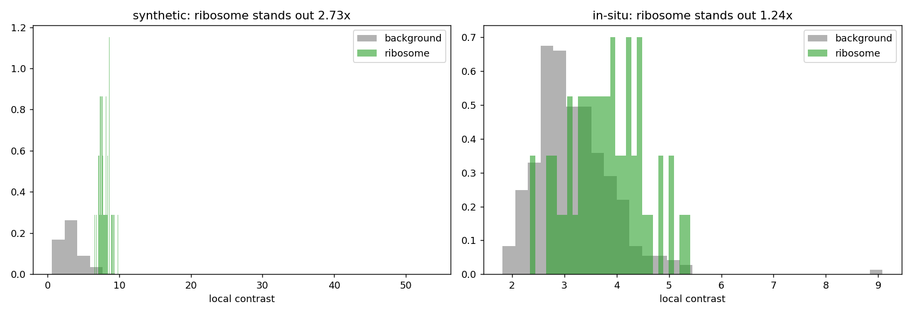

# CryoET Tasks - AI + CryoET Project

This repo contains submissions for the CZ cryoET project tasks.

---

## Task 1 - Transformer Training Review

**Folder:** `Task1/`

A code review and analysis of a protein fitness Transformer training script.

| File | Description |
|---|---|
| `code_review.md` | Full code review: what works, main issues, and how to restructure |
| `training_curves.png` | Training vs validation loss curves |
| `predictions.png` | Predicted vs actual scatter plot |

---

## Demo - Task 2b: Synthetic Ribosome Detection

*TopCUP detections (cyan) vs ground-truth ribosomes (red / green = matched) across all 184 slices of the synthetic tomogram. F1 = 0.76, localization error 37 Å.*

---

## Task 2 - CryoET Ribosome Picking with TopCUP

**Folder:** `Task2/`

An end-to-end pipeline that runs the pretrained **TopCUP** particle picker on two CZ
cryoET Data Portal tomograms and reports a quality assessment.

| Sub-task | What it does |
|---|---|
| **2a** - Download + visualize | Fetches tomograms, ribosome annotations, and model weights via the CZ data portal |
| **2b** - Inference on synthetic data | Runs TopCUP on an in-distribution synthetic tomogram; F1 = 0.76, localization 37 Å |
| **2c** - In-situ failure analysis | Runs the same model on real Chlamydomonas cellular data; diagnoses why it produces 0 detections (data drift) |
| **2d** - Improvement proposal | Technical plan to close the train-to-test distribution gap and restore in-situ performance |

### Key result

| Dataset | F1 | Localization |
|---|---|---|
| Synthetic (in-distribution) | **0.76** | 37 Å |
| Chlamydomonas in-situ (held-out) | **0.00** | - |

The drop from F1 0.76 to 0.00 on real cellular data - despite identical model, weights,
and config - is the core finding. It's driven by data drift: the model trained on clean
synthetic phantoms but the cellular tomogram is crowded, lower-contrast, and has a
different acquisition signature. Task 2c quantifies this; Task 2d proposes the fix.

**Why the model fails - ribosome contrast vs background:**

*In the synthetic training data, ribosomes stand out at 2.73× the local background - a clear signal.
In the real in-situ data, they're only 1.24× above background, buried in dense cytoplasm.
The model's learned filters never saw this low-contrast regime.*

### Quick start

See `Task2/README.md` for full setup (including the numcodecs install note for Apple
Silicon) and detailed run instructions.

---

## LLM usage

I used **Claude Sonnet 3.7 via Cline** (an AI coding assistant in VS Code) to help write
parts of this project.

The way it worked in practice: I designed the pipeline, worked out the approach for each
task, and planned what each script needed to do. I then used Claude to help turn those plans
into code faster than writing it by hand. It was useful for boilerplate-heavy parts like
the CPU patch wrapper and the data-drift analysis script, and for first drafts of the
markdown write-ups.

The parts that actually mattered I worked out myself through debugging - finding why the
copick VoxelSpacing directory format was wrong, tracing why predictions were all false
positives (the model was reading the apo-ferritin channel, not ribosome), working out the
correct coordinate convention, identifying that the 6-class config was the key fix. These
were not things the model suggested; they came from reading the error messages and checking
the data.

I verified all outputs by running the scripts end-to-end, checking numbers against the
portal ground truth, and fixing several bugs in the generated code (wrong relative paths,
the Windows symlink issue, the APNG color loss from mp4 chroma subsampling).
